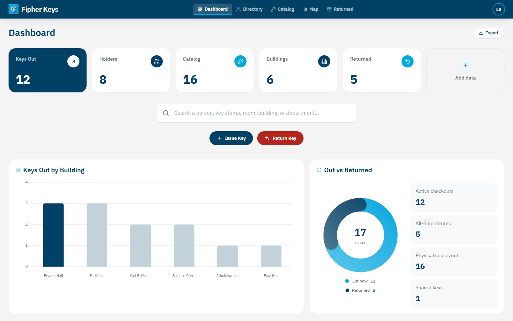
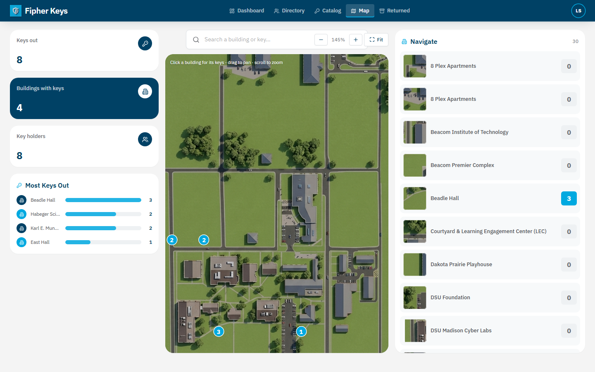
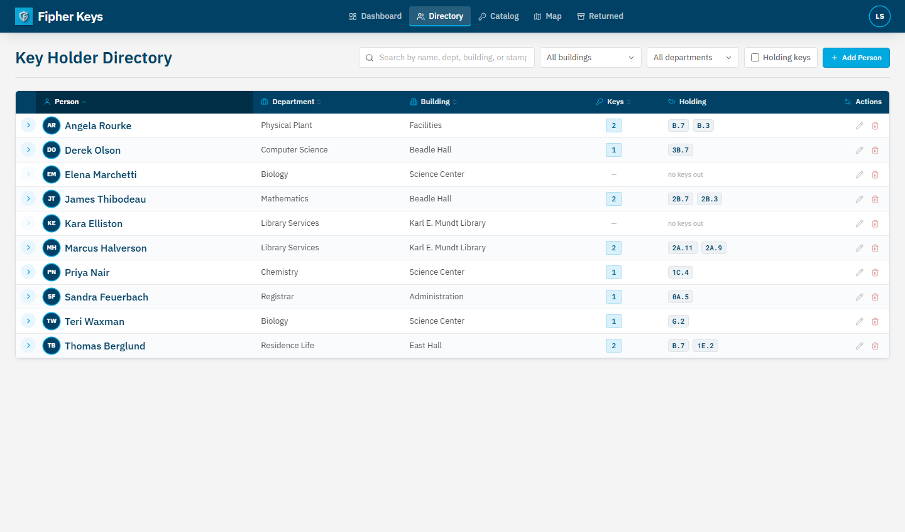
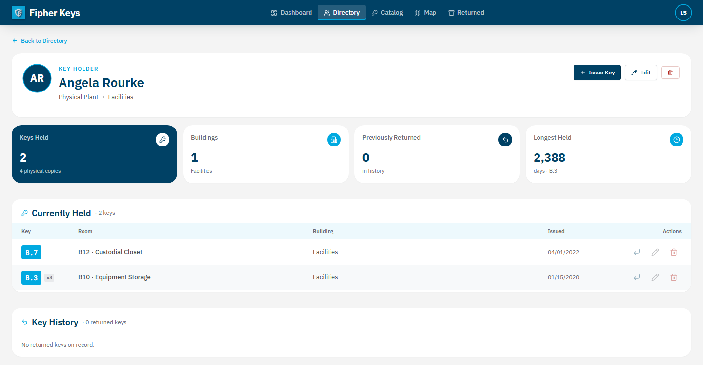
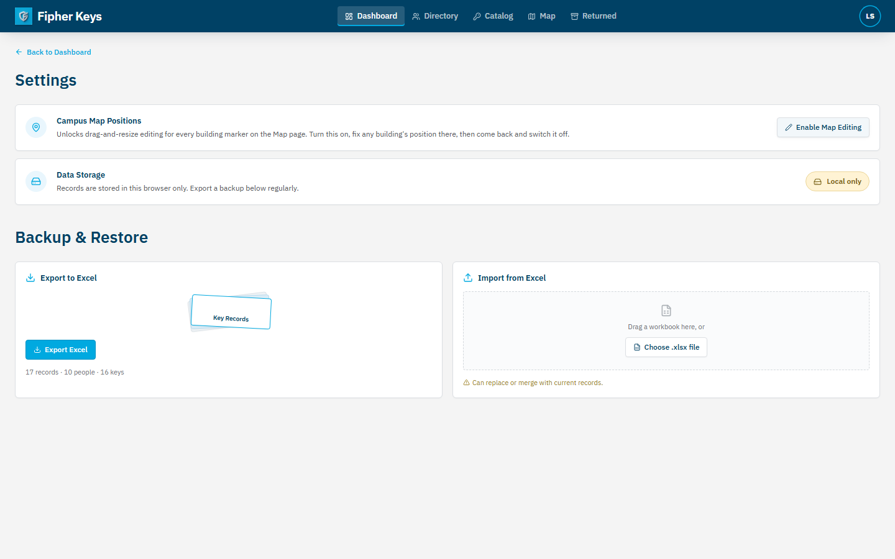

# Facilities Key Management

An internal tool for Facilities to keep track of physical keys — who's holding what, which building it belongs to, and when it went out or came back. It replaces the hand-maintained key spreadsheet with something searchable that also shows the whole campus on a map.

By default everything runs in the browser (data lives in `localStorage`), so you can try it without any setup. Point it at a Supabase project and it becomes a shared, logged-in app backed by Postgres instead.



## Running it

```bash
npm install
npm run dev      # http://localhost:5173
```

With no `.env` present it uses browser storage and skips the login entirely, which is the easiest way to poke around. `npm run build` produces the production bundle.

## Sample data

There's a test spreadsheet at [`samples/DSU-Test-Data.xlsx`](samples/DSU-Test-Data.xlsx): 100 key checkouts spread across 60 people, using the actual DSU building names so the map has something to show. Load it from the Data tab (Import) and you'll get a populated dashboard, directory, catalog, and map to explore.

Importing replaces whatever's currently stored, so don't run it against real data you want to keep.

## What's in it

**Dashboard.** The first thing you land on. It leads with how many keys are out right now, a few supporting counts (holders, catalog size, buildings, returned), and a search box. The Issue Key and Return Key buttons are here, and below that a Recent Activity feed of the latest checkouts and returns. Everything links through to the person or key it mentions.

**Map.** The campus map with a marker on each building. Buildings that currently have keys out show a count; hovering highlights the outline, and clicking opens the list of keys assigned there. The panel on the right ranks buildings by how many keys are out — hover a row and it lights up on the map. You can pan, zoom, and search from here too.



**Directory and Catalog.** The Directory is one row per person; expand a row to see the keys they're holding, and sort or filter by name, department, or building. The Catalog is the same idea for keys — every distinct stamp, its room and building, and how many copies are out.



**Detail pages.** Click a name or a key stamp to open its page. A person's page shows their info, what they're holding now, and their history; a key's page shows who has it and who had it before. The two link back and forth, so you can follow a chain from a person to a key to whoever else holds that key.



**Issuing and returning.** Issuing a key is a single dialog — search for the person and the key (and create either one inline if it's new), set the date, done. Returning finds an open checkout and marks it returned with a date; it keeps the record rather than deleting it, so history stays intact. Returned keys drop out of the everyday lists into their own Returned tab.

**Excel in and out.** It reads the existing key spreadsheets directly: every sheet in the workbook, matching columns by their headings, including split First/Last name columns and the combined room column. You get a per-sheet summary before anything is written. Export gives you a workbook you can re-import later.



## Supabase (optional)

Skip this unless you want the data shared across people and machines with logins.

1. Create a Supabase project and run the two migrations from `supabase/migrations/` (`0001_init.sql` then `0002_map_layout.sql`) in the SQL editor.
2. Add yourself under Authentication → Users (tick *Auto Confirm User*).
3. Copy `.env.example` to `.env` and fill in your project URL and anon/publishable key.
4. Restart the dev server. You'll get a login screen, and the data lives in Postgres with row-level security so only signed-in users can touch it.

The anon key is meant to be public in the frontend; what actually guards the data is RLS plus a signed-in session. `.env` is gitignored, so keep real credentials out of the repo.

## How it's built

React, TypeScript, and Vite, with Tailwind for styling and a small set of hand-written components instead of a component library. Excel handling is ExcelJS, loaded on demand so it doesn't weigh down the initial page. Fonts and colors follow the DSU brand.

Data sits behind a single `DataStore` interface (`src/lib/types.ts`) with two implementations — one for `localStorage`, one for Supabase — and the app uses whichever is configured. The model is three tables: people, keys (a stamp can have several physical copies, so a key row is the type, not the piece of metal), and assignments (one key issued to one person; no return date means it's still out).

```
src/
  app/
    App.tsx          shell, tabs, auth gate, dialogs
    theme.ts         brand colors + fonts
    components/      UI primitives and the create/edit dialogs
    views/           Dashboard, Directory, Catalog, KeyMap, Login, Data, ...
    map/             building positions + map drawing
  lib/
    types.ts         models + DataStore interface
    stores/          local + supabase
    excel.ts         import / export
supabase/migrations/ schema + RLS
public/campus-map.png
samples/             sample spreadsheet
```
