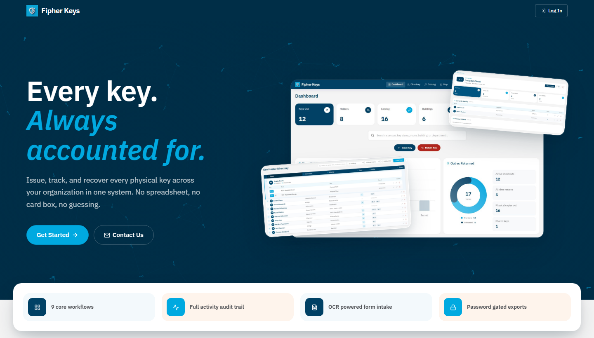
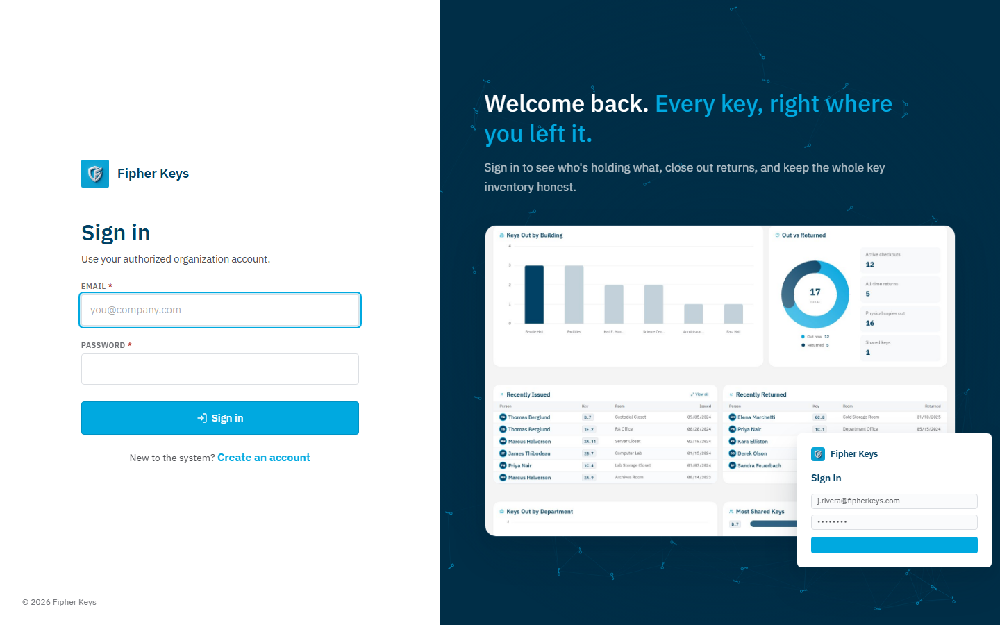
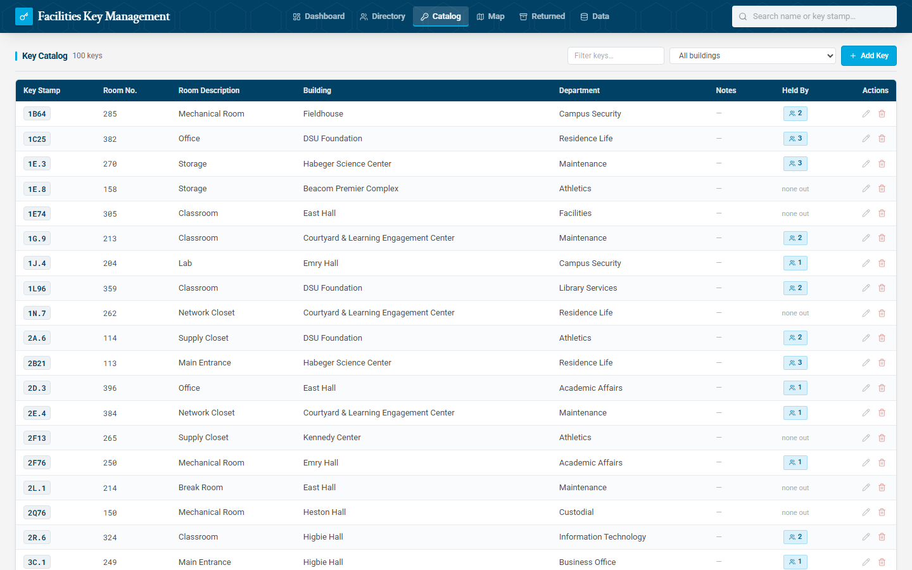
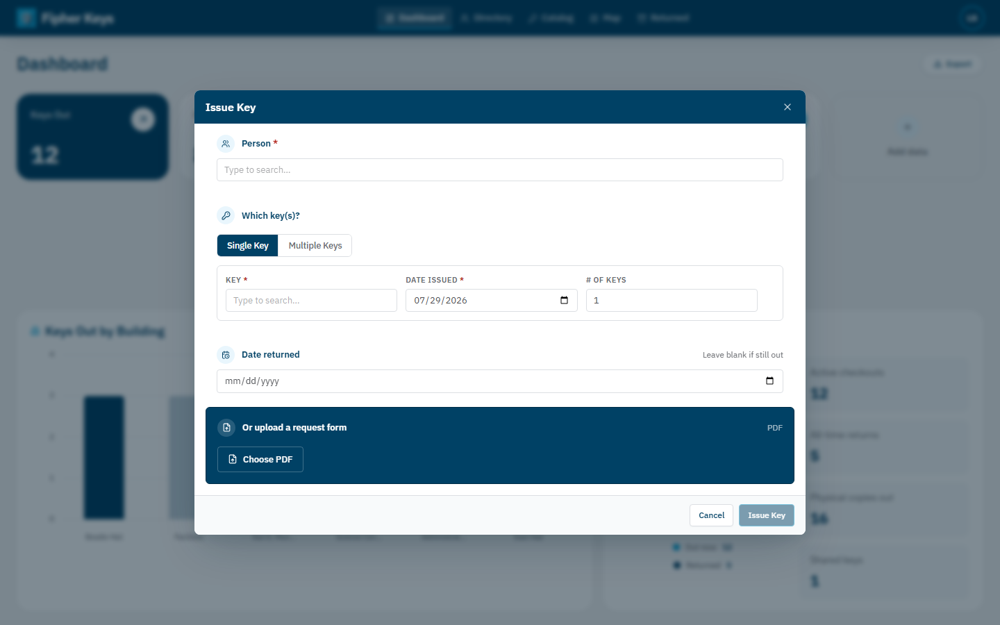
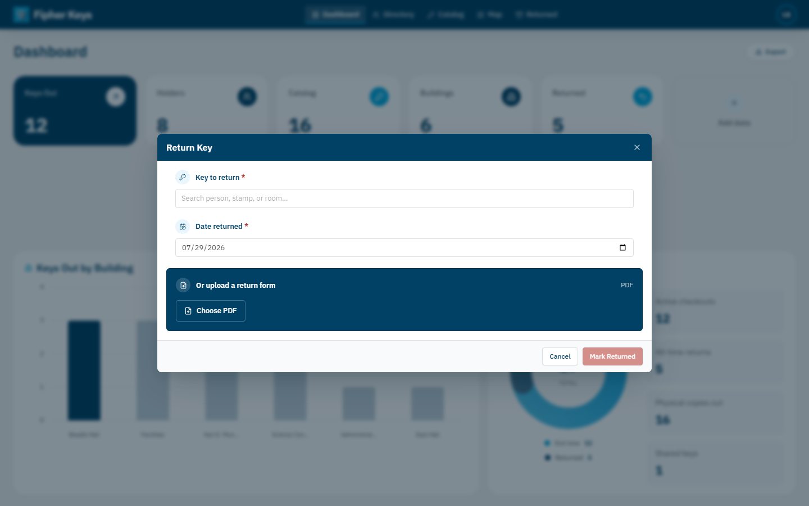
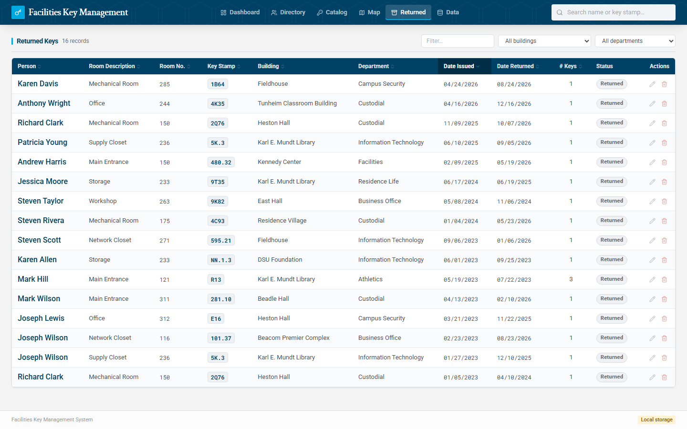
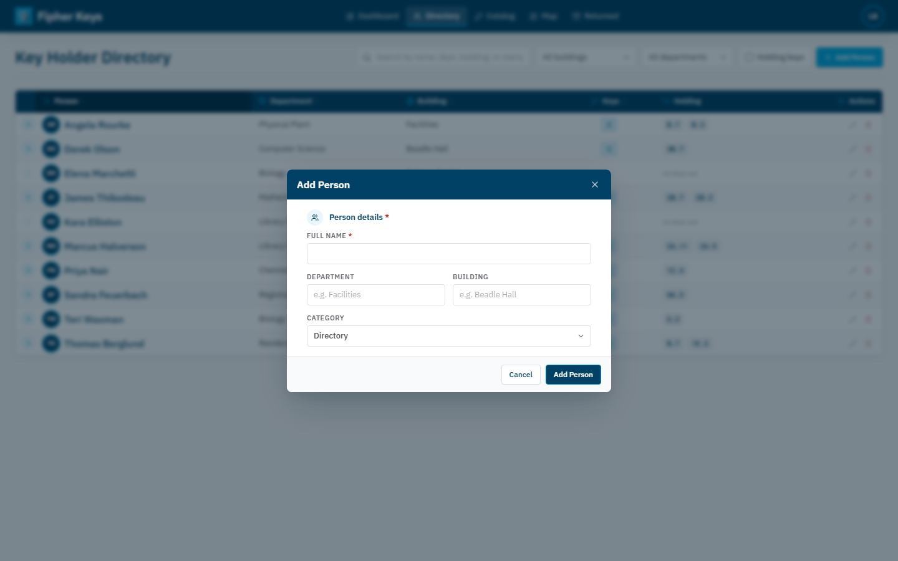
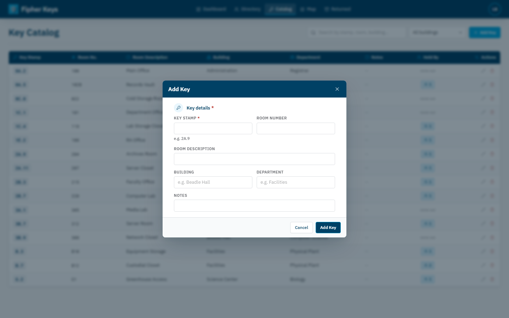

<div align="center">
  
  <h1>Fipher Keys</h1>
</div>

An internal tool for Facilities to keep track of physical keys — who's holding what, which building it belongs to, and when it went out or came back. It replaces the hand-maintained key spreadsheet with something searchable that also shows the whole campus on a map.

By default everything runs in the browser (data lives in `localStorage`), so you can try it without any setup. Point it at a Supabase project and it becomes a shared, multi-organization app with logins, access-code self-registration, and a platform admin console.


## Running it

```bash
npm install
npm run dev      # http://localhost:5173
```

With no `.env` present it uses browser storage and skips the login entirely, which is the easiest way to poke around. `npm run build` produces the production bundle.

## Sample data

There's a test spreadsheet at [`samples/DSU-Test-Data.xlsx`](samples/DSU-Test-Data.xlsx): 100 key checkouts spread across 60 people, using the actual DSU building names so the map has something to show. Load it from Settings → Import (or the Data page in local mode) and you'll get a populated dashboard, directory, catalog, and map to explore.

Importing replaces whatever's currently stored, so don't run it against real data you want to keep.

## What's in it

**Landing page.** A public marketing page at `/landing` — the pitch, a live-styled screenshot stack, a features grid, a walkthrough of the core workflows, and a contact form that routes straight into requesting an access code for your organization.



**Login / registration.** A full-bleed split page: sign in on the left, a preview of the product on the right. Creating an account asks for an organization access code, so only people who've been given one can join; the copy and headline change depending on whether you're signing in or registering.



**Dashboard.** The first thing you land on after signing in. It leads with how many keys are out right now, a few supporting counts (holders, catalog size, buildings, returned — each one click-through to that page), and a search box. Issue Key and Return Key are right here, plus a two-column breakdown (by building and by department) and a recent activity feed of the latest checkouts and returns.

**Map.** The campus map with a marker on each building. Buildings that currently have keys out show a count; hovering highlights the outline, and clicking opens the list of keys assigned there. The panel on the right ranks buildings by how many keys are out — hover a row and it lights up on the map. You can pan, zoom, and search from here too, and (for admins) drag buildings into position.


**Directory and Catalog.** The Directory is one row per person; expand a row to see the keys they're holding, and filter by building, department, or holding-keys status. The Catalog is the same idea for keys — every distinct stamp, its room and building, who's holding it right now, and how many copies are out.




**Detail pages.** Click a name or a key stamp to open its page. A person's page shows their info, what they're holding now, and their return history; a key's page shows who has it and who had it before. The two link back and forth, so you can follow a chain from a person to a key to whoever else holds that key.


**Issuing and returning.** Issuing a key is a single dialog — search for the person and the key (or create either one inline if it's new, including which roster/category a new person belongs to), set the date, done. You can issue several keys to one person in the same visit, or upload a request form as a PDF and let it fill the fields in for you (OCR kicks in automatically for scanned or handwritten forms).



Returning finds an open checkout by person, stamp, or room and marks it returned with a date — or upload a return form the same way. It keeps the record rather than deleting it, so history stays intact; returned keys drop out of the everyday lists into their own Returned tab.




Adding a person or a key directly is just as quick, with type-ahead building/department fields that suggest existing values or let you add a new one on the spot.




**Excel in and out.** It reads the existing key spreadsheets directly: every sheet in the workbook, matching columns by their headings, including split First/Last name columns and the combined room column. You get a per-sheet summary before anything is written. A person's "category" — which sheet of the original workbook they belonged to (Directory, Campus Watch, CommunityCenter, GA Forms, Sodexo, Facilities Department) — is preserved on import and editable afterward. Export rebuilds a workbook shaped exactly like the source file: the same sheets, headers, column widths, fonts, borders, and tab colors, so it drops straight back into whatever process the original spreadsheet was part of.


**Organizations & admin.** With Supabase configured, each account belongs to an organization, joined via an access code at registration. A platform admin console (visible only to platform admins) manages organizations, rotates access codes, and reviews or revokes accounts across every organization on the deployment.

## Supabase (optional)

Skip this unless you want the data shared across people and machines with logins.

1. Create a Supabase project and run the migrations in `supabase/migrations/` **in order** (0001 through 0010) in the SQL editor.
2. Add yourself under Authentication → Users (tick *Auto Confirm User*), or register through the app using one of the access codes seeded by migration `0005_organizations.sql`.
3. Copy `.env.example` to `.env` and fill in your project URL and anon/publishable key.
4. Restart the dev server. You'll get the login/registration screen, and the data lives in Postgres with row-level security so only signed-in members of an organization can touch that organization's data.

The anon key is meant to be public in the frontend; what actually guards the data is RLS plus a signed-in session tied to an organization. `.env` is gitignored, so keep real credentials out of the repo.

## How it's built

React, TypeScript, and Vite, with Tailwind for styling and a small set of hand-written components instead of a component library. Excel handling is ExcelJS, PDF text/OCR extraction uses pdf.js and Tesseract, all loaded on demand so they don't weigh down the initial page.

Data sits behind a single `DataStore` interface (`src/lib/types.ts`) with two implementations — one for `localStorage`, one for Supabase — and the app uses whichever is configured. The model is three tables: people (each with a category, for Excel round-tripping), keys (a stamp can have several physical copies, so a key row is the type, not the piece of metal), and assignments (one key issued to one person; no return date means it's still out).

```
src/
  app/
    App.tsx          shell, tabs, auth gate, dialogs
    theme.ts         brand colors + fonts
    components/      UI primitives and the create/edit dialogs
    views/           Dashboard, Directory, Catalog, KeyMap, Login, Landing,
                      Settings, Admin, Person/Key/Group detail, ...
    map/             building positions + map drawing
  lib/
    types.ts         models + DataStore interface
    stores/          local + supabase
    excel.ts         import / export
    pdfExtraction.ts, pdfOcr.ts   PDF request/return form parsing
supabase/migrations/ schema, RLS, organizations, admin, categories
public/campus-map.png, landing/   map art + marketing screenshots
samples/             sample spreadsheet
```
